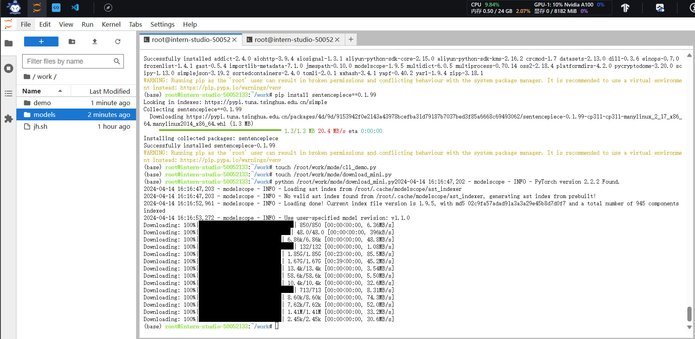
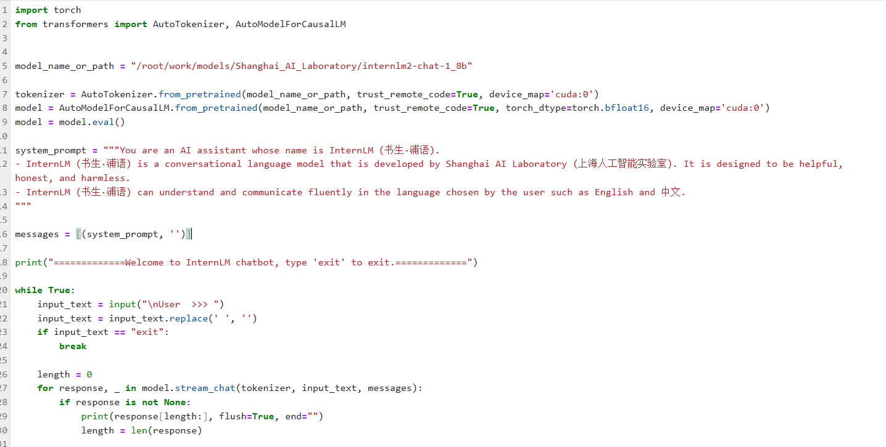
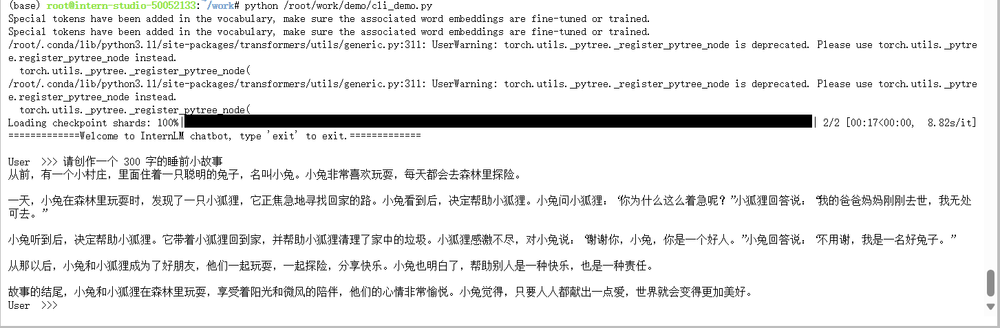
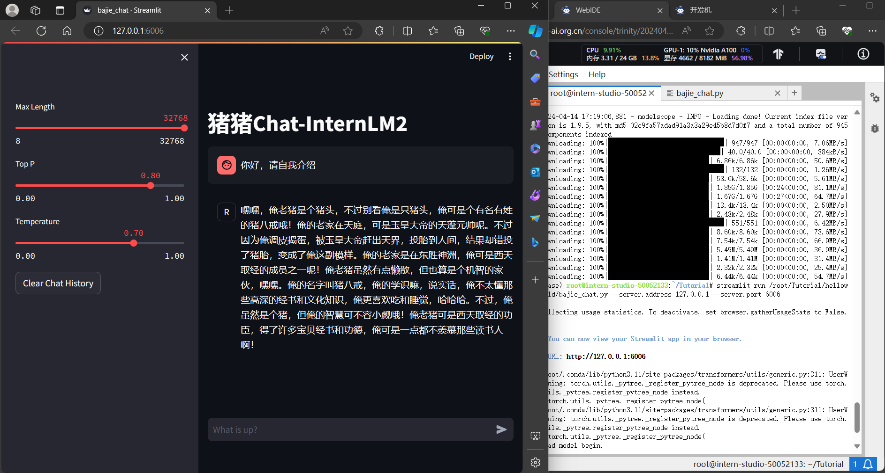

# 书生·浦语第二节

## 1 **主要内容**
- **部署 `InternLM2-Chat-1.8B` 模型**
- **部署实战营优秀作品`八戒-Chat-1.8B`模型**

## 2 **开始部署`InternLM2-Chat-1.8B`模型**

### 2.1 **环境部署**
这里是在开发机进行的部署


### 2.2 **下载模型`InternLM2-Chat-1.8B`模型**

这里我将模型下载到了`/root/work/modes`目录下



### 2.3 **执行cli_demo**
脚本填充如下：


执行命令如
```
python /root/work/demo/cli_demo.py
```

等待模型加载完成，键入内容如：
```
请创作一个 300 字的睡前小故事
```
效果如下：


## 3 **部署`八戒-Chat-1.8B`模型**
### 3.1 **配置环境**
在上一个项目里环境是已经有了的
### 3.2 **使用git获取项目**
### 3.3 **下载模型运行`Chat-八戒`demo**
启动
```
streamlit run /root/Tutorial/helloworld/bajie_chat.py --server.address 127.0.0.1 --server.port 6006
```
配置本地端口映射，打开并键入指令之后如图：


